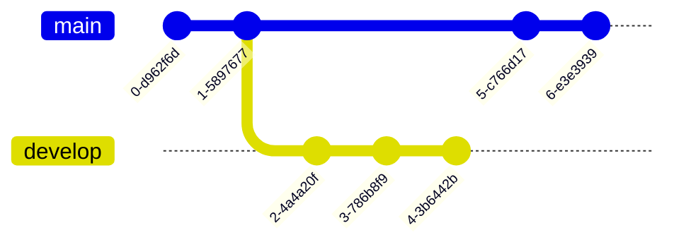

### Git flow khi làm việc một mình 

Khi phát triển tính năng cho sản phẩm, ta nên phát triển ở branch riêng để tránh tình trạng branch chính chứa những commit *bẩn*. Sau đây là cách phân chia branch được gợi ý.

* Các branch chính: 
  - Branch Master: Là branch chỉ dùng để theo dõi và đánh tag. Code ở đây là code ổn định nhất và chúng ta không phát triển tính năng trên branch này.
  - Branch Develop: Là branch dùng để  phát triển các tính năng mới cho phiên bản hiện tại. Đây là nhánh mẹ của các nhánh feature. 
  - Branch Release: Là branch được tạo ra khi merge nhánh Develop và nhánh Master. Đây là sản phẩm dành cho người dùng sử dụng.

* Các branch riêng: 
	- Branch feature: Là nhánh được tách ra từ nhánh Develop để phát triển các tính năng mới.
	- Branch bugfix: Là nhánh dùng để fixbug trong quá trình phát triển nhánh Develop 
	- Branch hotfix: Là nhánh dùng để fix các bug quan trọng. Cần phải fix gấp. 

